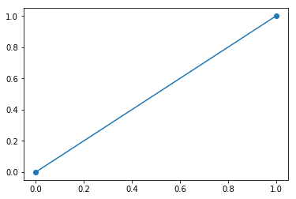

# Заголовок
текст $\frac{a}{b}$ $e^{i\pi} + 1 = 0$

$$e^x=\sum_{i=0}^\infty \frac{1}{i!}x^i$$


:::{custom-style="mytable"}
```python
a=1
print a
print a+1
```
:::

    1
    2
    


:::{custom-style="mytable"}
```python
from matplotlib import pyplot as plt
plt.plot([0,1],[0,1],'o-') # графік
plt.show()
print a
```
:::





    1
    
